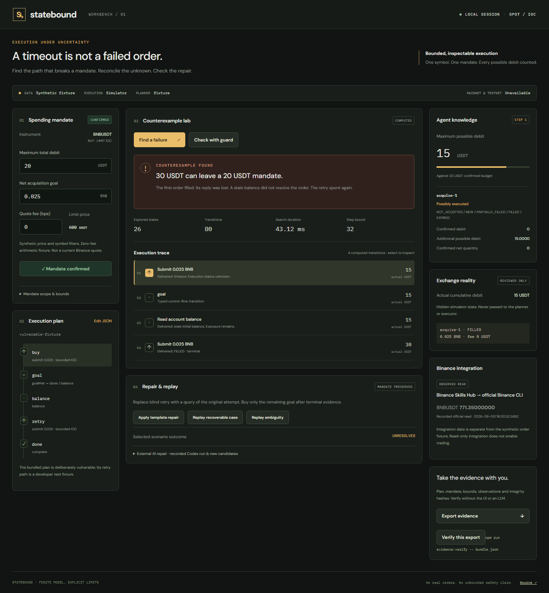

# Statebound

An execution workbench that computes how an uncertain order can break a trading mandate, checks a structural repair, and replays the checked plan through a constrained executor.



The flagship is deliberately vulnerable: a synthetic 15 USDT IOC order fills, its reply is lost, a stale balance arrives, and a blind retry spends another 15 USDT against a 20 USDT mandate. The checker finds that path from the input graph. A repaired graph queries the original attempt before buying the remaining goal.

## Run locally

Requires Node **24.14 or newer** and npm. No financial or model credentials are needed for the offline workflow.

```sh
npm ci
npm run demo:verify
npm run build
npm run dev
```

Open **http://127.0.0.1:4381**. The server binds only to the local interface. Runtime databases live in ignored `.runtime/`. `npm run dev` serves a built UI when `dist/` exists, or Vite middleware when it does not. Rebuild after changing the UI if serving `dist/`.

1. Review and confirm the budget, net quantity and synthetic fee assumption.
2. Click **Find a failure**. Select the first trace event to compare agent knowledge with reviewer-only exchange reality.
3. **Check with guard** demonstrates a refused retry. The guard preserves exposure after a timeout.
4. **Apply template repair** is an explicitly labeled offline convenience. The original and repaired graphs remain inspectable.
5. **Replay recoverable case** uses the shared interpreter and durable SQLite executor. **Replay ambiguity** preserves the pending reservation and finishes unresolved.
6. Export the evidence. The standalone verifier checks hashes, exact transitions and the declared bounded search.

## Commands

| Command | Purpose |
| --- | --- |
| `npm run lint` | TypeScript/JavaScript lint |
| `npm run typecheck` | Strict static checking |
| `npm test` | Core, property, persistence, authorization and runtime tests |
| `npm run test:holdout` | Separate parameter/fault evaluation corpus |
| `npm run demo:verify` | Offline counterexample, guard, template repair and verifier |
| `npm run plan:check -- examples/codex-repaired.json` | Check a supported input file |
| `npm run plan:repair -- examples/vulnerable.json examples/codex-repaired.json` | Validate an external agent candidate, preserve provenance and recheck |
| `npm run replay -- examples/counterexample.json` | Verify and replay the saved counterexample only |
| `npm run evidence:verify -- examples/counterexample.json` | Independently rerun replay and bounded search |
| `npm run integration:inspect` | Read official CLI version, quote and symbol filters; needs local CLI setup |
| `npm run test:http` | Auth, origin, idempotency, cancellation and export gates; server must be running |
| `npm run test:browser` | Browser workflow and screenshots; server and Playwright Chromium required |
| `npm run demo:record` | Record the actual browser flow |
| `npm run build` | Type check and production Vite build |

Install the optional test browser with `npx playwright install chromium`. The application itself does not need Playwright at runtime.

## What actually ran

- **Offline core:** computed baseline counterexample; exhaustive finite discrete checks; goal completion after supported recovery; unresolved status under permanent ambiguity.
- **AI repair:** the active development Codex session authored and submitted a structured repair through the local CLI. [Input, output, rationale and recheck evidence](examples/external-agent-run.json) are preserved as `external_agent`. Loading this recorded candidate in the UI is not live generation. There is no configured hosted model provider or live AI web button.
- **Official integration:** genuine public testnet quote and exchange-info reads through Binance Skills Hub's documented official CLI route, version 2.1.1. [Integration evidence and setup](docs/BINANCE_INTEGRATION.md). The app shows a recorded read with timestamp, separately from its synthetic order fixture. No Binance MCP connection or authenticated account read is claimed.
- **Execution:** simulated orders only. No certified testnet write adapter and no mainnet execution. Adding a key does not enable trading.
- **Browser:** actual checks, repair, replay, reload and exported evidence tested at 1440x900 and 1280x800. Screenshots above are from the running app.

The separate evaluation corpus has 48 scenarios per variant. The repaired graph had **0 budget violations, 36 completions and 12 unresolved outcomes**. See [full denominators](docs/EVALUATION.md). It is a regression corpus, not an independent blinded model benchmark.

## Boundaries that matter

Money uses 8-decimal scaled integers, not floating point. Fees are bounded fixture assumptions; third-asset fees are unsupported. Each order's confirmed debit and possible additional debit are distinct. The checker enumerates exact discrete IOC outcomes at the fixture price. It does not certify a continuous price range, all exchange failures, other agents' activity or live Binance execution.

SQLite attempts are prepared transactionally before dispatch; a crash does not free the reservation. Attempts retain permanent tombstones. A local approval binds the normalized action, plan, mandate, adapter, model and account. Simulator rehearsals automatically approve their fake actions; this is never an exchange host approval.

Hashes establish local integrity relative to a trusted reference. They do not authenticate Binance, establish financial safety or prove that a saved model output was generated live. A locally consistent forged bundle is not an exchange attestation.

Read [SPEC](docs/SPEC.md), [model assumptions](docs/MODEL_ASSUMPTIONS.md), [evaluation](docs/EVALUATION.md), [related work](docs/RELATED_WORK.md) and [handoff](docs/HANDOFF.md). Submission drafts are in `submission/`; no public deployment, social post or entry submission is part of this build.
